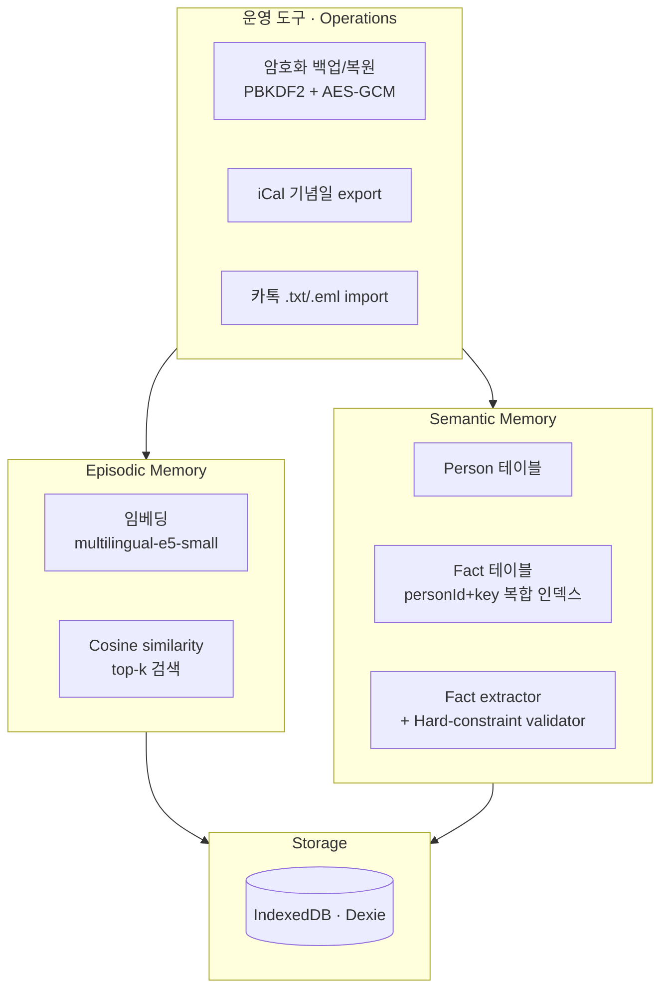
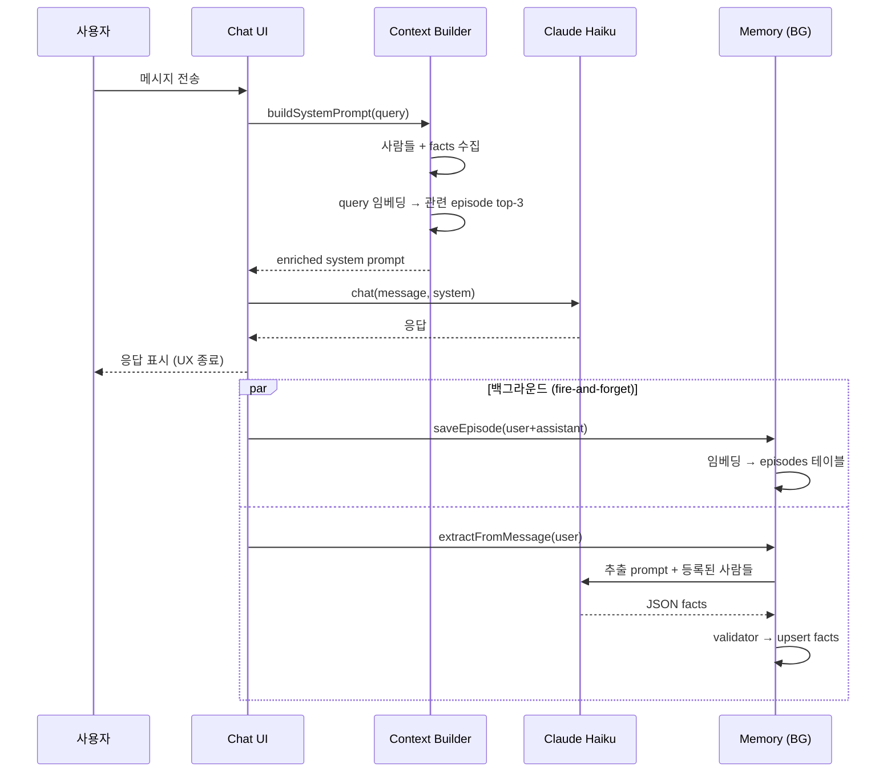

# tale-01-personal-diary-iq

> 너의 사적인 일기 에이전트.
> 모든 데이터는 너의 브라우저에만 산다.

🔗 **Live**: https://saga-tales.github.io/tale-01-personal-diary-iq/
📁 **Repo**: https://github.com/Saga-Tales/tale-01-personal-diary-iq

---

## 무엇

소중한 사람들 — 연인, 가족, 친구, 동료 — 에 대한 정보를 기록하면, 시간이 지날수록 LLM 에이전트가:

1. 사람별 사실(MBTI, 알러지, 직업, 취미 등)을 **자동으로 누적**
2. 과거 대화 일화를 **의미 검색**으로 회상
3. 맥락에 맞는 **구체적 조언** 제공 (일반론 금지)

ChatGPT와 가장 큰 차이: **기억이 너의 브라우저에만 살고**, Anthropic API 키도 너 본인 것을 직접 쓴다. 백엔드 서버 자체가 존재하지 않는다.

## 왜

기존 관계 CRM 도구들(Volley, Monaru, Dex, Recall, Mem) 대부분 SaaS — 친구·가족·연인에 대한 매우 사적인 정보를 그들의 서버에 위탁해야 한다. Notion으로 직접 정리하던 사람도 많지만, 정리는 수동 작업이고 회상은 grep + 인간 기억에 의존한다.

이 프로젝트가 검증하려는 가설:

| 가설 | 검증 방법 | 현재 상태 |
|---|---|---|
| Local-first AI가 충분히 가능한가 | transformers.js로 임베딩 로컬 실행 | ✅ multilingual-e5-small, 32MB 양자화, 첫 로드 후 캐시 |
| BYOK 모델이 사용자 신뢰를 얻는가 | 데이터가 서버에 가지 않는다는 것을 코드로 증명 | 🟡 dogfooding으로 검증 중 |
| 자동 fact extraction이 수동 정리보다 낫나 | 6주 dogfooding 후 회고 | 🟡 진행 중 |

---

## 빠른 시작

### 사용자 입장

1. [Live 사이트](https://saga-tales.github.io/tale-01-personal-diary-iq/) 접속
2. [console.anthropic.com](https://console.anthropic.com)에서 API 키 발급 (보통 $5 충전이면 한 달 사용 가능)
3. **설정** → API 키 입력 → 저장 (브라우저 localStorage에만 저장됨)
4. **사람들** → 중요한 사람 등록 (이름, 관계, 생일, 자유 메모)
5. **대화** → 일상 적기. 시간이 지날수록 에이전트가 맥락을 알게 됨
6. **데이터** → 정기 백업 (브라우저 캐시 날아가도 복구 가능)

### 개발자 입장

요구사항: **Node 20+**

```bash
git clone https://github.com/Saga-Tales/tale-01-personal-diary-iq
cd tale-01-personal-diary-iq
npm install      # .npmrc에 ignore-scripts=true 있어 sharp 등 native binary 설치 스킵
npm run dev      # http://localhost:5173/tale-01-personal-diary-iq/
```

빌드:
```bash
npm run build    # dist/ 에 정적 파일 생성
```

`main` 브랜치 push 시 GitHub Actions가 자동 배포 (`.github/workflows/deploy.yml`).

---

## 아키텍처

4 레이어 구조 — 위로 갈수록 추상화:



각 레이어는 독립적으로 작동 — 상위 레이어가 망가져도 하위는 정상 동작 (예: 임베딩 모델 로드 실패해도 채팅 + fact 추출은 동작).

### 메시지 처리 파이프라인

사용자가 "오늘 티뉴랑 점심 먹는데 떡볶이 알러지 있다고 함" 보낸 후:



핵심: 백그라운드 작업은 fire-and-forget. 채팅 UX가 fact extraction이나 임베딩을 기다리지 않는다.

---

## 핵심 설계 결정

### 1. Hard-constraint validator 패턴

LLM이 fact 추출 시 헛소리할 수 있다. 그래서 추출 결과를 받은 후 코드 레벨에서 검증:

```typescript
function validateAndResolve(raw: RawFact[], people: Person[]): ValidationResult {
  // 1. confidence >= 0.5
  // 2. key는 1~30자, 문장 형태(.?!) 거부
  // 3. value는 1~200자
  // 4. person_name이 등록된 사람과 매칭 (정확 이름 OR 관계어 "여친"/"엄마"/...)
  // 위 4개 모두 통과한 것만 DB에 입력
}
```

`iq-blogger` 프로젝트에서 처음 적용한 패턴 — LLM이 만들어낸 거 그대로 신뢰하지 않고 deterministic 검증을 그 위에 둔다.

### 2. Upsert by composite key

Fact는 `(personId, key)` 쌍이 unique. 같은 카테고리에서 새 정보가 들어오면 갱신:

```typescript
// "티뉴 알러지: 떡볶이" → 나중에 "티뉴 알러지: 견과류"
// → 떡볶이가 견과류로 갱신, 중복 row 안 생김
```

Dexie `[personId+key]` 복합 인덱스로 O(log n) 조회.

### 3. Local embedding으로 비용 + 프라이버시 동시 해결

OpenAI/Voyage 임베딩 API 쓰면 메시지 데이터가 또 다른 외부에 나간다. transformers.js로 브라우저 로컬 실행하면:

- **비용**: $0 (Anthropic 채팅 비용만 남음)
- **프라이버시**: 임베딩 = 의미 표현, 이게 외부에 안 나가면 검색용 벡터가 누구에게도 안 보임
- **트레이드오프**: 첫 로드 시 ~32MB 모델 다운로드 (이후 IndexedDB 캐시)

### 4. BYOK as architecture, not feature

사용자 API 키가 브라우저 localStorage에만 산다. 우린 키를 절대 만질 수 없다. 이건 단순 기능이 아니라 **백엔드 부재**의 자연스러운 결과 — 중앙 집중형 키 보관 자체가 불가능하다.

### 5. Fire-and-forget 백그라운드 워크

```typescript
// Chat.tsx
const reply = await chat(message, system)  // 응답 받음
setMessages(...)                             // UI 업데이트 (UX 종료)

saveEpisode(user, reply).catch(...)         // 비동기 저장
extractFromMessage(message).then(...).catch(...) // 비동기 추출
```

`await` 없이 background promise. UX는 결코 메모리 쓰기를 기다리지 않는다.

---

## Privacy & 데이터 소유권

| 항목 | 처리 방식 |
|---|---|
| 채팅 메시지 | IndexedDB (사용자 브라우저) + Anthropic API 호출 시 일시 전송 |
| 사람·사실·일화 | IndexedDB only, 외부 전송 없음 |
| 임베딩 벡터 | 브라우저에서 생성, IndexedDB 저장. 외부 전송 없음 |
| API 키 | localStorage (사용자 브라우저). 우리 코드 내부 함수만 접근 |
| 백업 파일 | PBKDF2 (100K iter) + AES-GCM 256-bit. 비밀번호 잃으면 복구 불가 |
| 분석 / 트래킹 | 없음 |

⚠️ **솔직한 한계**: 채팅 메시지는 Anthropic API에 전송된다 (Anthropic의 [데이터 처리 정책](https://www.anthropic.com/privacy) 적용). 완전 로컬 LLM 채팅은 향후 과제.

---

## Tech stack

| 영역 | 선택 | 이유 |
|---|---|---|
| Build | Vite | 빠른 dev, 간단한 정적 빌드, GH Pages 친화 |
| UI | React 18 + TypeScript | 익숙함, 타입 안정성 |
| Styling | Tailwind v4 | 낮은 설정 부담, paper/ink 토큰 정의 |
| Storage | IndexedDB via Dexie | 브라우저 기본 NoSQL, 큰 용량, 트랜잭션 |
| Chat LLM | Anthropic Claude Haiku 4.5 | 한국어 품질 + 가성비 |
| Fact extraction LLM | 같은 Haiku 4.5 | 단일 키 운영, 별도 모델 추가 부담 없음 |
| Embedding | @xenova/transformers + multilingual-e5-small | 한국어 retrieval에 충분, 양자화 후 32MB |
| Email parsing | postal-mime | .eml 카톡 export 처리 |
| Crypto | Web Crypto API | 브라우저 native, 외부 lib 없음 |
| Hosting | GitHub Pages | 무료, public, 자동 배포 |

---

## 비용

운영 비용 (사용자당, 2026-05 기준):

```
chat 1회:           ~500 input + ~300 output tokens
fact extraction 1회: ~500 input + ~150 output tokens
                                                   
Claude Haiku 4.5 가격대 가정 (변동 가능):
chat:  ~$0.0008 / 메시지
fact:  ~$0.0006 / 메시지
embed: $0 (브라우저 로컬)
                                                   
하루 30개 메시지 사용자: ~$0.04/day = 약 $1.2/month
하루 100개 메시지 헤비 사용자: ~$4/month
```

인프라 비용: **$0** (정적 호스팅 + BYOK).

---

## 프로젝트 구조

```
src/
├── App.tsx                  # 라우터 + 네비
├── main.tsx                 # React entry, ErrorBoundary
├── index.css                # Tailwind + 디자인 토큰 (paper/ink)
│
├── db/
│   └── schema.ts            # Dexie 스키마: people / facts / episodes / messages
│
├── lib/
│   ├── anthropic.ts         # Claude API 클라이언트 (BYOK)
│   ├── context.ts           # System prompt 빌더 (사람 + facts + 관련 episodes)
│   ├── extractor.ts         # Fact extractor (Claude → JSON → upsert)
│   ├── validator.ts         # Hard-constraint 검증 (iq-blogger pattern)
│   ├── embedder.ts          # transformers.js 싱글톤 (dynamic import)
│   ├── retriever.ts         # Cosine similarity 검색 + episode 저장
│   ├── summarizer.ts        # 다이제스트: 긴 대화 → 구조화된 요약
│   ├── ical.ts              # 생일 .ics 생성
│   ├── backup.ts            # PBKDF2 + AES-GCM 암호화 백업
│   └── kakao.ts             # 카톡 .txt/.eml 파서 + bulk import
│
├── components/
│   ├── ApiKeyGate.tsx       # API 키 없으면 /settings 리다이렉트
│   ├── ErrorBoundary.tsx    # 에러 시 빈 화면 대신 진단 표시
│   └── FileDropZone.tsx     # 재사용 파일 업로드 (드래그+클릭)
│
└── pages/
    ├── Chat.tsx             # 채팅 + 임베딩 preload + toast
    ├── People.tsx           # Person CRUD + facts 표시 + 개별 삭제
    ├── Digest.tsx           # 긴 대화 요약 (paste/file → 구조화된 결과)
    ├── Settings.tsx         # API 키 입력 / 삭제
    └── Data.tsx             # 기념일 + 백업 + 카톡 import (3 카드)
```

---

## 로드맵

**완료**

- ✅ **Day 1**: Storage + 기본 채팅 + Person CRUD + 자동 배포
- ✅ **Day 2**: System prompt에 사람 정보 주입 + Fact extraction + Hard-constraint validator
- ✅ **Day 3**: Episode embedding (multilingual-e5-small) + RAG retrieval + ErrorBoundary
- ✅ **Day 4**: 기념일 .ics + 암호화 백업/복원 + 카톡 .txt/.eml import + UX 다듬기
- ✅ **Day 5**: 다이제스트 — 긴 대화에서 핵심 추출 (주요 화제, 결정, 액션 아이템, 인용, 분위기, 참여자별 요약)

**검토 중 (Day 6+)**

- Person 상세 페이지 (한 사람의 모든 episode 타임라인)
- Streaming 응답 (대화 즉시 반응성 향상)
- 검색 (전체 메시지·일화 키워드/의미 검색)
- 온보딩 플로우 (첫 사용자 가이드)
- PWA (홈 화면 추가, 오프라인 사용)
- 음성 입력 (감정 토로용)
- 다이제스트를 episode로 저장 (요약된 메모리)
- 로컬 LLM 옵션 (전체 오프라인, 채팅까지 로컬)

---

## Saga-Tales 맥락

이 프로젝트는 [Saga-Tales](https://github.com/Saga-Tales) venture studio의 **첫 번째 tale**.

Vibe-coding 방법론의 검증 과제:
- **사이즈**: ~6주 안에 끝낼 수 있는가
- **공개 가능**: 코드와 라이브 사이트가 공개 가능한가
- **Dogfoodable**: 만든 사람이 실제로 매일 쓸 수 있는가
- **측정 가능**: 결과를 정량/정성적으로 평가할 수 있는가

Promotion ceremony 후보로 제출 예정.

### 빌드 과정에서 배운 것

1. **MVP는 layered하게 쌓아라.** Day 1 = pure storage, Day 2 = semantic, Day 3 = episodic. 한 번에 다 짜려 했으면 첫 주에 갇혔을 것.
2. **Hard-constraint validator는 LLM 시대의 필수.** LLM이 항상 정상 작동한다고 가정하지 말고, 결과를 deterministic 코드로 검증하는 레이어가 항상 필요하다.
3. **로컬 임베딩은 진짜 가능하다.** transformers.js + 양자화 모델이면 충분히 production-grade. 비용 제로, 프라이버시 자동 해결.
4. **Fire-and-forget이 UX의 핵심.** AI 기능은 종종 느리다 (수 초~수 분). 사용자를 기다리게 하지 않는 비동기 구조가 결정적.
5. **BYOK는 architecture로 봐야 한다.** 단순 "사용자 키 입력 받기" 기능이 아니라, 백엔드 부재의 자연스러운 귀결로서 설계되어야 신뢰가 작동.

---

## 만든 사람

- **한동희 (IQ)** — 설계, 구현, dogfooding
- **보욱 (BW)** — Saga-Tales 공동 창업, dogfooding partner

## Acknowledgments

- **Anthropic** — Claude API
- **Xenova / Hugging Face** — transformers.js, multilingual-e5
- **Dexie** — IndexedDB wrapper
- **postal-mime** — .eml 파싱
- **iq-blogger** — Hard-constraint validator 패턴의 출처

## License

MIT — 자유롭게 fork, 수정, 배포 가능.
